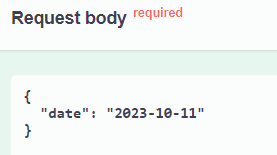
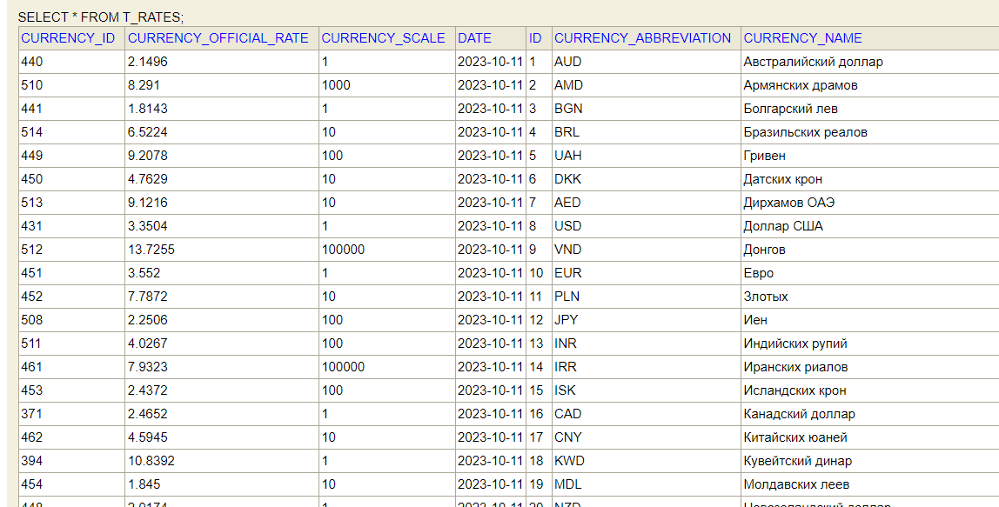
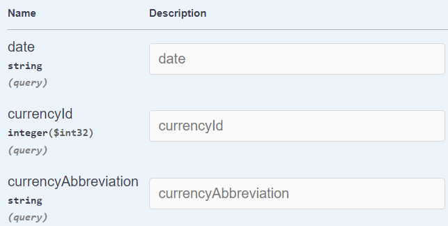
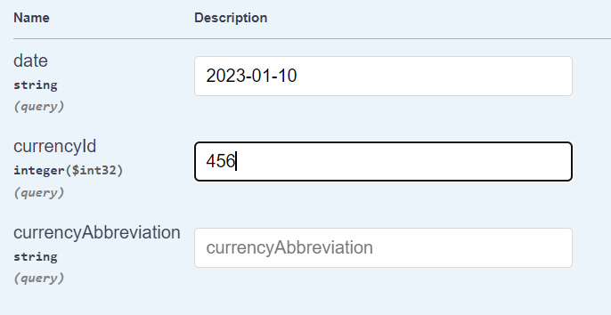
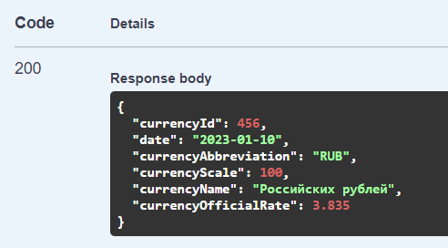
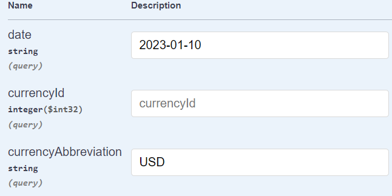
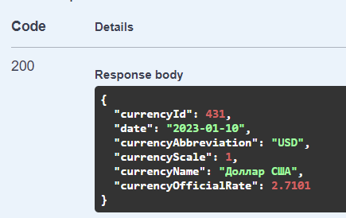

# Test task Vodorod

Автор : Симоненко Владислав

# Первый endpoint

Адрес :`http://localhost:8080/api/v1/rates/load`

Для сохранения записей в h2 базу необходимо выполнить 
POST запрос, включайщий в теле запроса дату в формате 'yyyy-MM-dd'

При выполнении запроса с такими данными сохранятся следующие записи

#  Второй endpoint

Адрес :`http://localhost:8080/api/v1/rates`

Для сохранения записей в h2 базу необходимо выполнить
GET запрос, включайщий следующие параметры

Параметр даты обязателен, из остальных параметров должен быть хотя бы одни(поиск по внутреннему коду валюты либо 
по буквенному коду валюты).

Первый пример запросов:

Ответ:

Второй пример запросов:

Ответ:

# Дополнительно
В консоль h2 базы можно попасть по адресу
`http://localhost:8080/h2-console`

Получить доступ к Swagger можно по адресу
`http://localhost:8080/swagger-ui/index.html`

